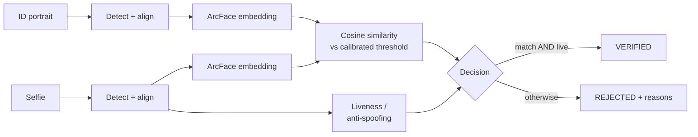
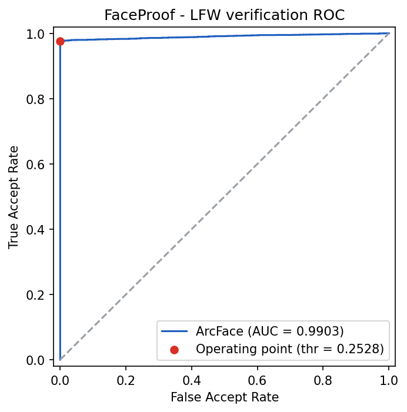
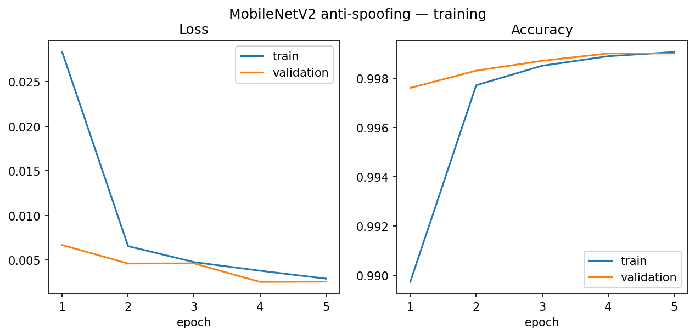
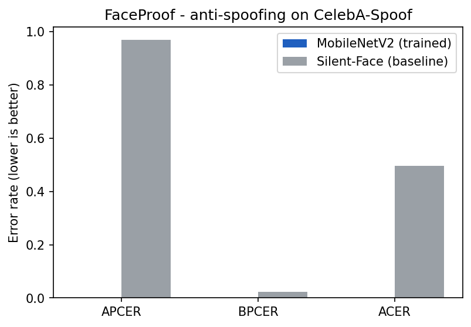

# FaceProof

**Face verification + liveness detection — an open reference implementation of the
computer-vision subsystem behind identity verification.**


Identity verification rests on two computer-vision questions: _is the selfie the same
person as the ID portrait?_ and _is the selfie a live face — not a printout or a screen
replay?_ Most public reference implementations stop at one hosted-API call and a
match/no-match label — no threshold calibration, no presentation-attack handling, no
honest evaluation. FaceProof builds the subsystem properly: detection, alignment,
embeddings, **data-calibrated** decision thresholds, anti-spoofing, and a reproducible
evaluation report behind every number.

> Non-commercial portfolio / reference-implementation project. Product spec: `docs/PRD.md`.

## Architecture



A stateless pipeline: detect → align → embed → match → liveness → explainable decision.
No database — uploaded images are processed in memory and never stored. The pipeline,
the FastAPI service exposing it, and a React upload/result UI are all built; deploying
the container to Cloud Run is the last step (see Roadmap).

## Features

**Face verification (complete)**

- SCRFD face detection with 5-point landmark alignment to the canonical 112×112 crop.
- ArcFace 512-d embeddings (`w600k_r50`), L2-normalized so matching is a dot product.
- Cosine-similarity matching against a threshold **calibrated from the LFW ROC curve** —
  never a guessed constant.

**Liveness / anti-spoofing (complete)**

- Apache-2.0 **Silent-Face / MiniFASNet** integrated as a working baseline detector.
- A **MobileNetV2 classifier**, transfer-learned on a 67k-image CelebA-Spoof subset —
  **99.90% validation accuracy** — benchmarked head-to-head against that baseline.

**Evaluation & rigor**

- 6000-pair LFW verification protocol with a reproducible report.
- Pure-NumPy calibration and PAD metrics (ROC/AUC/EER; APCER/BPCER/ACER), fully
  unit-tested with no ML dependency.
- Every metric reproducible from committed raw scores, or end-to-end via a GPU notebook.

**Engineering**

- Test-first development — 44 tests, `ruff` + `mypy --strict` clean on every commit.
- Lazy model loading — the package imports without the heavy CV stack (keeps CI light).
- Environment-driven config; CPU by default, one env var to run on GPU.

## Tech Stack

| Layer                | Technologies                                        |
| -------------------- | --------------------------------------------------- |
| Computer vision      | InsightFace (SCRFD + ArcFace), ONNX Runtime, OpenCV |
| Evaluation           | NumPy, scikit-learn, Matplotlib                     |
| Training             | PyTorch, torchvision, Hugging Face Datasets         |
| Service (Phase 3)    | FastAPI, Uvicorn, Pydantic                          |
| Frontend (Phase 3)   | React, TypeScript                                   |
| Tooling & CI         | pytest, ruff, mypy (strict), GitHub Actions         |
| Deployment (Phase 4) | Docker, GCP Cloud Run                               |

## Getting Started

**Prerequisites:** Python 3.10.

```bash
git clone https://github.com/soneeee22000/faceproof.git
cd faceproof
python -m venv .venv
source .venv/bin/activate            # Windows: .venv\Scripts\activate
pip install -e ".[dev,ml]"           # dev tooling + the CV/ML stack
cp .env.example .env
```

Common commands:

```bash
pytest -q                            # run the test suite
ruff check .                         # lint
mypy faceproof                       # strict type-check
python -m evaluation.run_lfw_evaluation   # reproduce the LFW evaluation
uvicorn faceproof.api:app --reload   # run the API on :8000
```

## API

A stateless FastAPI service. Every response uses one envelope —
`{"data": <result>, "error": null}` on success, `{"data": null, "error": {"code", "message"}}`
on failure.

| Method | Endpoint        | Purpose                                           |
| ------ | --------------- | ------------------------------------------------- |
| GET    | `/api/health`   | Liveness/readiness probe                          |
| POST   | `/api/verify`   | Verify a selfie vs. an ID portrait (match + live) |
| POST   | `/api/match`    | Face match only                                   |
| POST   | `/api/liveness` | Liveness / anti-spoofing only                     |

The React upload/result UI lives in `frontend/` — `npm install && npm run dev` for
development, `npm run build` for production (FastAPI then serves the built `dist/`).

## Evaluation

### Face verification — LFW

Evaluated on the **6000-pair LFW verification protocol**. The match threshold is
calibrated from the ROC curve — not guessed.

| Metric                         | Value  |
| ------------------------------ | ------ |
| ROC AUC                        | 0.9903 |
| Equal Error Rate               | 2.22%  |
| Accuracy @ operating threshold | 98.81% |
| Operating threshold (cosine)   | 0.2528 |



Full report: `evaluation/results/lfw_report.md`. Every metric is reproducible from the
committed raw scores (`evaluation/results/lfw_scores.npz`) via
`evaluation.calibration.calibrate`, or end-to-end with `python -m evaluation.run_lfw_evaluation`.
`evaluation/colab_lfw_evaluation.ipynb` runs the full protocol on a free GPU.

### Liveness / anti-spoofing — CelebA-Spoof

A MobileNetV2 anti-spoofing classifier, transfer-learned on a 67k-image CelebA-Spoof
subset over 5 epochs — **99.90% validation accuracy**, with train and validation curves
tracking together (no overfitting).



On the **10,020-image held-out test split**, scored with APCER / BPCER / ACER
(ISO/IEC 30107-3) and benchmarked against the zero-shot Silent-Face baseline:

| Model                  | APCER  | BPCER | ACER      |
| ---------------------- | ------ | ----- | --------- |
| MobileNetV2 (trained)  | 0.04%  | 0.00% | **0.02%** |
| Silent-Face (baseline) | 96.82% | 2.39% | 49.60%    |



The fine-tuned model is near-perfect on the held-out split. The Silent-Face baseline runs
zero-shot _and_ on pre-cropped faces — it is designed to crop a face from a wider frame —
so it operates outside its intended input conditions; the comparison shows the value of
task-specific fine-tuning, not a like-for-like baseline benchmark. Full report:
`evaluation/results/antispoofing_report.md`; reproducible via
`evaluation/colab_antispoofing_evaluation.ipynb`.

## Project Structure

```
faceproof/
├── faceproof/            # inference package
│   ├── detection.py      # SCRFD face detection + 5-point alignment
│   ├── embedding.py      # ArcFace 512-d embeddings
│   ├── matching.py       # cosine similarity + calibrated decision
│   ├── liveness.py       # Silent-Face / MiniFASNet anti-spoofing
│   ├── decision.py       # combine match + liveness into a verdict
│   ├── images.py         # upload decoding + validation
│   ├── api.py            # FastAPI app — /api/verify, /api/match, /api/liveness
│   └── schemas.py · config.py · errors.py · _minifasnet.py
├── frontend/             # React + Vite + TypeScript upload/result UI
├── training/             # CelebA-Spoof loader + MobileNetV2 training (+ Colab notebook)
├── evaluation/           # LFW + anti-spoofing harness, metrics, Colab notebooks
│   └── results/          # reports, plots, raw scores
├── tests/                # pytest — mirrors the packages
├── docs/                 # PRD.md, ARCHITECTURE.md
├── models/ · data/       # trained model committed; third-party weights & datasets downloaded
└── Dockerfile · pyproject.toml · .github/workflows/ci.yml
```

## Roadmap

| Phase | Scope                                                                | Status   |
| ----- | -------------------------------------------------------------------- | -------- |
| 1     | Face verification — detection, embedding, matching, LFW calibration  | Complete |
| 2     | Liveness / anti-spoofing — CelebA-Spoof CNN vs. Silent-Face baseline | Complete |
| 3     | Service & UI — FastAPI pipeline + React upload/result UI             | Complete |
| 4     | Deploy — Docker image to GCP Cloud Run                               | Next     |

<!-- TODO: Add demo GIF once the Phase 3 UI ships -->

## Licensing

Project code: **MIT**. InsightFace **code** is MIT; its **pretrained weights** are
non-commercial research only — FaceProof is non-commercial. Silent-Face / MiniFASNet
weights are Apache 2.0. Datasets (LFW, CelebA-Spoof) are not redistributed — see
`data/README.md`.

## Author

**Pyae Sone (Seon)** — [github.com/soneeee22000](https://github.com/soneeee22000)
