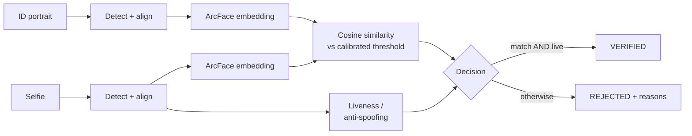

# FaceProof

**Face verification + liveness detection — an open reference implementation of the
computer-vision subsystem behind identity verification.**


Identity verification rests on two computer-vision questions: _is the selfie the same
person as the ID portrait?_ and _is the selfie a live face — not a printout or a screen
replay?_ Most public reference implementations stop at one hosted-API call and a
match/no-match label — no threshold calibration, no presentation-attack handling, no
honest evaluation. FaceProof builds the subsystem properly: detection, alignment,
embeddings, **data-calibrated** decision thresholds, anti-spoofing, and a reproducible
evaluation report behind every number.

> Non-commercial portfolio / reference-implementation project. Product spec: `docs/PRD.md`.

## Architecture



A stateless pipeline: detect → align → embed → match → liveness → explainable decision.
No database — uploaded images are processed in memory and never stored. The liveness
stage is the next build phase (see Roadmap); face verification is complete today.

## Features

**Face verification (complete)**

- SCRFD face detection with 5-point landmark alignment to the canonical 112×112 crop.
- ArcFace 512-d embeddings (`w600k_r50`), L2-normalized so matching is a dot product.
- Cosine-similarity matching against a threshold **calibrated from the LFW ROC curve** —
  never a guessed constant.

**Evaluation & rigor**

- 6000-pair LFW verification protocol with a reproducible report.
- Pure-NumPy calibration — ROC, AUC, EER, and accuracy-maximizing threshold selection,
  fully unit-tested with no ML dependency.
- Every metric reproducible from committed raw scores, or end-to-end via a GPU notebook.

**Engineering**

- Test-first development — 28 tests, `ruff` + `mypy --strict` clean on every commit.
- Lazy model loading — the package imports without the heavy CV stack (keeps CI light).
- Environment-driven config; CPU by default, one env var to run on GPU.

## Tech Stack

| Layer                | Technologies                                        |
| -------------------- | --------------------------------------------------- |
| Computer vision      | InsightFace (SCRFD + ArcFace), ONNX Runtime, OpenCV |
| Evaluation           | NumPy, scikit-learn, Matplotlib                     |
| Training (Phase 2)   | PyTorch                                             |
| Service (Phase 3)    | FastAPI, Uvicorn, Pydantic                          |
| Frontend (Phase 3)   | React, TypeScript                                   |
| Tooling & CI         | pytest, ruff, mypy (strict), GitHub Actions         |
| Deployment (Phase 4) | Docker, GCP Cloud Run                               |

## Getting Started

**Prerequisites:** Python 3.10.

```bash
git clone https://github.com/soneeee22000/faceproof.git
cd faceproof
python -m venv .venv
source .venv/bin/activate            # Windows: .venv\Scripts\activate
pip install -e ".[dev,ml]"           # dev tooling + the CV/ML stack
cp .env.example .env
```

Common commands:

```bash
pytest -q                            # run the test suite
ruff check .                         # lint
mypy faceproof                       # strict type-check
python -m evaluation.run_lfw_evaluation   # reproduce the LFW evaluation
uvicorn faceproof.api:app --reload   # run the API (health probe)
```

## Evaluation

Face verification is evaluated on the **6000-pair LFW verification protocol**. The match
threshold is calibrated from the ROC curve — not guessed.

| Metric                         | Value  |
| ------------------------------ | ------ |
| ROC AUC                        | 0.9903 |
| Equal Error Rate               | 2.22%  |
| Accuracy @ operating threshold | 98.81% |
| Operating threshold (cosine)   | 0.2528 |


Full report: `evaluation/results/lfw_report.md`. Every metric is reproducible from the
committed raw scores (`evaluation/results/lfw_scores.npz`) via
`evaluation.calibration.calibrate`, or end-to-end with `python -m evaluation.run_lfw_evaluation`.
`evaluation/colab_lfw_evaluation.ipynb` runs the full protocol on a free GPU.

## Project Structure

```
faceproof/
├── faceproof/            # inference package
│   ├── detection.py      # SCRFD face detection + 5-point alignment
│   ├── embedding.py      # ArcFace 512-d embeddings
│   ├── matching.py       # cosine similarity + calibrated decision
│   ├── config.py         # environment-driven settings
│   ├── errors.py         # domain errors
│   └── api.py            # FastAPI app (health probe; pipeline endpoints in Phase 3)
├── evaluation/           # offline evaluation harness
│   ├── calibration.py    # pure-NumPy ROC / AUC / EER / threshold selection
│   ├── lfw.py            # LFW pair loading
│   ├── run_lfw_evaluation.py
│   ├── colab_lfw_evaluation.ipynb   # GPU evaluation notebook
│   └── results/          # report, ROC curve, raw scores
├── tests/                # pytest — mirrors faceproof/
├── docs/                 # PRD.md, ARCHITECTURE.md
├── models/ · data/       # weights & datasets — downloaded, never committed
└── Dockerfile · pyproject.toml · .github/workflows/ci.yml
```

## Roadmap

| Phase | Scope                                                                | Status      |
| ----- | -------------------------------------------------------------------- | ----------- |
| 1     | Face verification — detection, embedding, matching, LFW calibration  | Complete    |
| 2     | Liveness / anti-spoofing — CelebA-Spoof CNN vs. Silent-Face baseline | In progress |
| 3     | Service & UI — FastAPI pipeline + React upload/result UI             | Planned     |
| 4     | Deploy — Docker image to GCP Cloud Run                               | Planned     |

<!-- TODO: Add demo GIF once the Phase 3 UI ships -->

## Licensing

Project code: **MIT**. InsightFace **code** is MIT; its **pretrained weights** are
non-commercial research only — FaceProof is non-commercial. Silent-Face / MiniFASNet
weights are Apache 2.0. Datasets (LFW, CelebA-Spoof) are not redistributed — see
`data/README.md`.

## Author

**Pyae Sone (Seon)** — [github.com/soneeee22000](https://github.com/soneeee22000)
