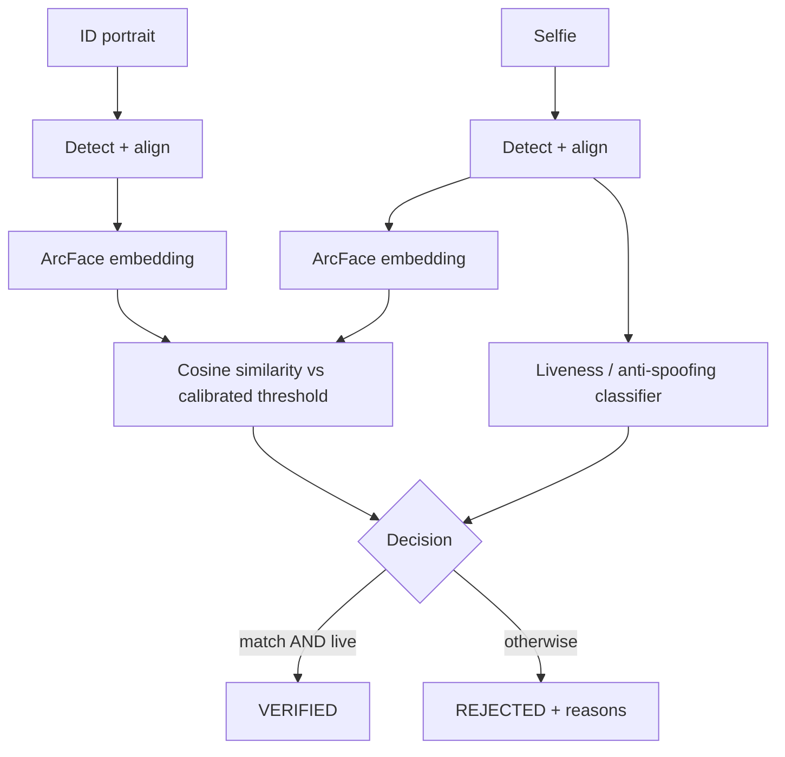

# FaceProof — Architecture

A stateless computer-vision service that answers two identity-verification questions —
_same person?_ and _live face?_ — with calibrated, evaluated models.

## Verification pipeline

A request is **VERIFIED** only if the faces match _and_ the selfie passes liveness. Every
sub-result (score, threshold, label) is returned — the decision is never an opaque boolean.

## Components

| Module                | Responsibility                                            |
| --------------------- | --------------------------------------------------------- |
| `faceproof/detection` | Face detection + 5-point alignment (InsightFace SCRFD)    |
| `faceproof/embedding` | ArcFace face embeddings                                   |
| `faceproof/matching`  | Cosine similarity + data-calibrated decision threshold    |
| `faceproof/liveness`  | Anti-spoofing — trained classifier + Silent-Face baseline |
| `faceproof/pipeline`  | Orchestrates the verification decision                    |
| `faceproof/api`       | FastAPI service                                           |
| `training/`           | Anti-spoofing training (CelebA-Spoof)                     |
| `evaluation/`         | LFW + CelebA-Spoof evaluation notebooks + plots           |
| `frontend/`           | React upload/result UI                                    |

## Deployment

Single Docker image, **CPU-only**, on GCP Cloud Run. The React build is served as static assets
by the FastAPI app. No database — the service is stateless (two images in, a decision out).
Uploaded images are processed in memory and never persisted.

## Architecture Decision Records

- **ADR-001 — Anti-spoofing.** Train a transfer-learned CNN on CelebA-Spoof; ship the Apache-2.0
  Silent-Face / MiniFASNet model as baseline and fallback. Guarantees a working component and
  demonstrates a genuinely trained vision model rather than an API wrapper.
- **ADR-002 — Face models.** InsightFace SCRFD (detection) + ArcFace (embeddings). Code is MIT;
  pretrained weights are non-commercial research use — acceptable, this project is non-commercial.
- **ADR-003 — No database.** Stateless inference service; persistence would be unjustified.
- **ADR-004 — Deployment.** One CPU-only Docker container on Cloud Run; every model must run on CPU.
- **ADR-005 — Datasets.** LFW (verification eval) + CelebA-Spoof (anti-spoofing train/eval).
  Neither is redistributed — `data/` holds download scripts and citations only.

## Evaluation

- **Face verification:** LFW pairs → ROC, AUC, FAR/FRR; the operating threshold is selected from
  the ROC curve and documented.
- **Anti-spoofing:** CelebA-Spoof test split → APCER / BPCER / ACER, accuracy, ROC; the trained
  classifier is benchmarked head-to-head against the Silent-Face baseline.
- Output: a reproducible `evaluation/` notebook with committed plots — every reported metric
  traces back to it.
