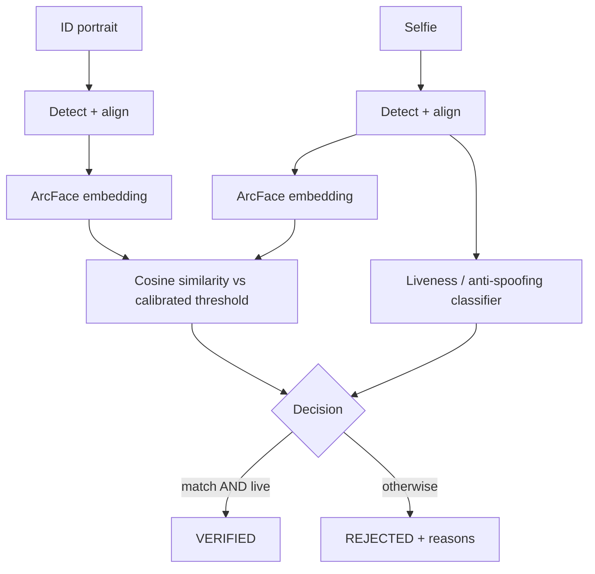

# PRD: FaceProof

> **Status:** Draft | In Review | Approved
> **Author:** Pyae Sone (Seon)
> **Date:** 2026-05-17
> **Last Updated:** 2026-05-17

> **Intended Scope:** FaceProof is an **open-source portfolio / reference-implementation piece**,
> non-commercial. It makes no moat, market, or commercial claims — none appear in this PRD or in
> any project artifact.

---

## 1. Problem Statement

### What problem are we solving?

Identity verification rests on two computer-vision questions: _is the selfie the same person as
the ID portrait?_ and _is the selfie a live face — not a printout or a screen replay?_ Most open
and public reference implementations stop at a single vision-API call and a match/no-match label:
no decision-threshold calibration, no presentation-attack (spoof) handling, no honest evaluation.
There is no compact, deployed, well-evaluated open reference that shows the full subsystem built
properly — detection, alignment, embeddings, calibration, anti-spoofing, and reproducible metrics.

### Who has this problem?

Engineers and technical reviewers who want a clear, runnable reference for face verification +
liveness done with genuine computer-vision rigor — not a thin wrapper around a hosted API.

### Why now?

The pieces are now openly available: a permissively-licensed pretrained anti-spoofing model
(Silent-Face / MiniFASNet, Apache 2.0) and a large labelled anti-spoofing dataset (CelebA-Spoof).
The full subsystem is buildable solo, on CPU, without proprietary data.

---

## 2. Success Criteria

### Primary Metric

All six **v1 Definition of Done** items green and the service deployed at a live public URL:

1. Face detection + alignment on arbitrary input photos
2. ArcFace embedding + similarity scoring with a **data-calibrated** threshold
3. Liveness / anti-spoofing rejecting print + replay attacks (trained classifier + baseline)
4. Reproducible evaluation report (ROC, FAR/FRR on LFW; APCER/BPCER/ACER on CelebA-Spoof)
5. Deployed — live public URL
6. Repo — README, tests, evaluation notebook

### Secondary Metrics

- [ ] Face verification AUC competitive with published LFW baselines for the chosen model
- [ ] Anti-spoofing ACER reported on CelebA-Spoof; trained classifier benchmarked vs. Silent-Face
- [ ] Evaluation is fully reproducible from committed scripts/notebook + a dataset download script
- [ ] CPU inference latency reasonable for an interactive demo (single request, no GPU)
- [ ] 80%+ test coverage on pipeline business logic (matching, decision, calibration)

### What does "done" look like?

Anyone can open the live URL, submit an ID-style portrait and a selfie, and get an **explainable**
verified/rejected decision (with match score, threshold, and liveness label) — and can open the
repo and reproduce every CV metric from the evaluation notebook.

---

## 3. User Stories & Acceptance Criteria

### Story 1: Verify a selfie against an ID portrait (core flow)

**As a** reviewer, **I want to** submit an ID portrait and a selfie and receive a verification
decision, **so that** I can see the full pipeline work end to end.

**Acceptance Criteria:**

- [ ] Given two images each containing one detectable face, when I `POST /api/verify`, then I
      receive `verified` (bool) plus `face_match{similarity, threshold, is_match}` and
      `liveness{score, label, is_live}` and human-readable `reasons`.
- [ ] Given the two faces are the same live person, when verified, then `verified = true`.
- [ ] Error state: when no face is detected in one or both images, then `422` with a clear message.

### Story 2: Reject presentation attacks (liveness)

**As a** reviewer, **I want** spoofed selfies (printed photo, screen replay) rejected, **so that**
I can see the anti-spoofing component actually works.

**Acceptance Criteria:**

- [ ] Given a printed-photo or screen-replay selfie, when verified, then `liveness.is_live = false`
      and `verified = false` with a reason naming the spoof.
- [ ] Given a genuine live selfie, when verified, then `liveness.is_live = true`.
- [ ] The liveness decision uses a threshold calibrated on held-out data, not a guessed constant.

### Story 3: Reproduce the evaluation (rigor proof)

**As a** technical reviewer, **I want** a reproducible evaluation report, **so that** I can trust
every metric shown.

**Acceptance Criteria:**

- [ ] Given the dataset download script has been run, when I run the evaluation notebook, then it
      reproduces ROC / AUC / FAR / FRR on LFW and APCER / BPCER / ACER on CelebA-Spoof.
- [ ] The face-match operating threshold is **selected from the LFW ROC curve** and documented.
- [ ] The trained anti-spoofing classifier is benchmarked head-to-head against the Silent-Face baseline.

### Story 4: Understand the decision (explainability)

**As a** reviewer, **I want** every sub-score returned, **so that** the decision is never a black box.

**Acceptance Criteria:**

- [ ] Every `/api/verify` response exposes the match similarity, the threshold, and the liveness
      score/label — never just a final boolean.

---

## 4. Technical Architecture

Full design in `docs/ARCHITECTURE.md`.

### Stack Decision

| Layer     | Choice                                   | Why                                                                  |
| --------- | ---------------------------------------- | -------------------------------------------------------------------- |
| Frontend  | React + TypeScript                       | Simple upload/result UI; matches existing portfolio stack            |
| Backend   | Python 3.10 + FastAPI                    | CV ecosystem is Python; FastAPI for typed, documented endpoints      |
| CV models | InsightFace (SCRFD + ArcFace), PyTorch   | State-of-the-art detection/embeddings; PyTorch for the trained model |
| Liveness  | Trained CNN (CelebA-Spoof) + Silent-Face | Trained model proves real CV; Silent-Face (Apache 2.0) = baseline    |
| Database  | **None**                                 | Stateless inference service — persistence would be unjustified       |
| Auth      | **None** (v1)                            | Public demo; no accounts. Rate limiting instead.                     |
| Hosting   | GCP Cloud Run (Docker, CPU-only)         | Matches existing stack; scales to zero; cheap for a demo             |
| CI/CD     | GitHub Actions (lint + test + build)     | Standard; gates every commit                                         |

### Architecture Diagram

### API Design (Key Endpoints)

| Method | Endpoint      | Purpose                                         | Auth |
| ------ | ------------- | ----------------------------------------------- | ---- |
| GET    | /api/health   | Liveness/readiness probe                        | No   |
| POST   | /api/verify   | Verify selfie vs ID portrait (match + liveness) | No   |
| POST   | /api/match    | Face-match only (demo component endpoint)       | No   |
| POST   | /api/liveness | Liveness only (demo component endpoint)         | No   |

### Data Model (Key Entities)

None persisted. Request/response DTOs only (Pydantic models). Uploaded images are processed
in-memory and **not stored** (see Security).

### Third-Party Dependencies

| Dependency               | Purpose                       | Risk Level | Alternative                    |
| ------------------------ | ----------------------------- | ---------- | ------------------------------ |
| InsightFace              | Detection + ArcFace embedding | Medium     | `face_recognition` (dlib, MIT) |
| Silent-Face / MiniFASNet | Liveness baseline + fallback  | Low        | Train-only (no baseline)       |
| PyTorch                  | Train the anti-spoofing CNN   | Low        | TensorFlow/Keras               |
| FastAPI / Uvicorn        | API service                   | Low        | Flask                          |

Licensing: InsightFace **code** is MIT; **pretrained weights** are non-commercial research only —
acceptable, FaceProof is non-commercial; stated plainly in the README. Silent-Face is Apache 2.0.

---

## 5. Edge Cases & Error Handling

| Scenario                            | Expected Behavior                                              | Priority |
| ----------------------------------- | -------------------------------------------------------------- | -------- |
| No face detected in an image        | 422 with explicit message, no crash                            | P0       |
| Multiple faces in an image          | Use highest-confidence face; note it in `reasons`              | P1       |
| Tiny / blurry / low-quality face    | Proceed if detectable; flag low detection confidence in result | P1       |
| Extreme head pose / heavy occlusion | Alignment best-effort; flag if landmarks unreliable            | P1       |
| Non-image or corrupt file uploaded  | Reject with 415/422 before model inference                     | P0       |
| File too large                      | Client-side size check + server limit, 413 with message        | P1       |
| Grayscale / unusual color space     | Normalize to RGB before inference                              | P2       |
| Model weights missing at startup    | Fail fast with a clear error; download script documented       | P0       |
| Cold start (Cloud Run model load)   | Lazy-load once per container; health check reflects readiness  | P1       |

### Security Considerations

- [ ] Input validation on all endpoints (Pydantic + file type/size checks)
- [ ] Uploaded images processed in-memory and **never persisted** (privacy by default)
- [ ] EXIF / metadata stripped from uploads before processing
- [ ] CORS configured explicitly (no wildcard in production)
- [ ] Rate limiting on `/api/verify` (public demo abuse protection)
- [ ] No secrets in code — environment variables only; `.env` gitignored
- [ ] Datasets (LFW, CelebA-Spoof) **never committed** — download scripts + citations only

---

## 6. Testing Strategy

### Unit Tests (Target: 80%+ on pipeline business logic)

- [ ] Matching: cosine similarity, threshold decision
- [ ] Decision logic: combine match + liveness into verified/reasons
- [ ] Calibration: threshold selection from an ROC curve
- [ ] Liveness wrapper: label/score mapping
- [ ] Image validation / preprocessing functions

### Integration Tests

- [ ] `POST /api/verify` — happy path, no-face (422), spoof selfie, bad file
- [ ] `POST /api/match`, `POST /api/liveness` — happy + error paths
- [ ] `GET /api/health`

### E2E Tests (Critical Paths Only)

- [ ] Core flow: upload two images in the UI → verified result rendered
- [ ] Spoof flow: spoof selfie → rejected with reason

### What NOT to test

- Internals of pretrained third-party models (InsightFace, Silent-Face) — treated as trusted deps.
- Cloud Run platform behavior — covered by deployment smoke check, not unit tests.

---

## 7. Milestones & Build Order

> No fixed calendar timeline. **v1 ships when the 6 Definition-of-Done items are green.** Extra
> time buys polish on those six — never a seventh feature (per PRFAQ scope freeze). Phases mirror
> `ARCHITECTURE.md`.

### Phase 0: Scaffold

- [ ] Repo, package skeleton, Dockerfile, configs, model/dataset download scripts
- [ ] CI pipeline (lint + test + build), one passing smoke test
- **Gate:** install / lint / test / build all green; CI green

### Phase 1: Face Verification

- [ ] Detection + alignment + ArcFace embedding + matching
- [ ] LFW evaluation → ROC → **calibrated threshold**
- **Gate:** DoD items 1, 2 done; LFW metrics reproduced (DoD 4 partial)

### Phase 2: Liveness

- [ ] Integrate Silent-Face baseline; train the CelebA-Spoof classifier
- [ ] Anti-spoofing evaluation; trained vs. baseline benchmark
- **Gate:** DoD item 3 done; DoD item 4 complete

### Phase 3: Service & UI

- [ ] Pipeline orchestration + FastAPI endpoints + React UI
- **Gate:** core user stories 1–4 work end-to-end with tests

### Phase 4: Deploy & Document

- [ ] Deploy to GCP Cloud Run; README, tests, evaluation notebook finalized
- **Gate:** DoD items 5, 6 done — all six green; v1 ships

---

## 8. Out of Scope (Explicitly)

- NOT building: document/ID OCR + MRZ extraction (ICAO 9303) — **explicit v2**, separate branch
- NOT building: 3D-mask attack detection, video-based / challenge-response liveness
- NOT building: user accounts, auth, or any persisted user data
- NOT building: a mobile app or in-browser webcam capture (possible v1.1)
- NOT building: multi-face / crowd handling beyond "pick the main face"
- NOT for: commercial use — non-commercial portfolio piece only

---

## 9. Open Questions

- [ ] Exact InsightFace model pack/variant (accuracy vs. CPU latency trade-off) — decided in Phase 1
- [ ] Anti-spoofing backbone for the trained classifier (MobileNetV2 vs. DenseNet) — decided in Phase 2
- [ ] Cloud Run: accept cold starts vs. keep 1 min-instance for the demo — decided in Phase 4

---

## 10. Approval

- [ ] **PRD reviewed and understood** — I (Seon) confirm the requirements are clear
- [ ] **Architecture approved** — the technical approach makes sense (already approved in ARCHITECTURE.md)
- [ ] **Scope locked** — no features added during build without updating this PRD

> Once approved, this PRD is the source of truth. Every feature, endpoint, and component traces
> back to a user story above. If it's not in the PRD, it's not getting built.
